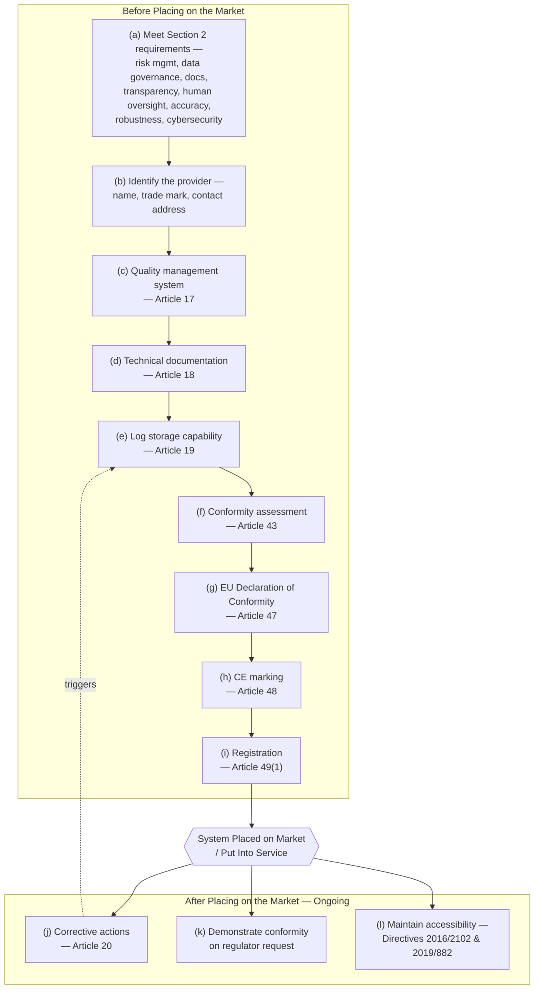

# EU AI Act Article 16 — High-Risk AI Provider Compliance Program

## Project Overview

Article 16 of the EU AI Act sets out twelve specific obligations that a **provider** of a high-risk AI system must satisfy across the system's full lifecycle — before it ever reaches the market, and continuously after deployment. This project translates those twelve legal obligations into an operational compliance program: a practical checklist, a lifecycle workflow, ownership assignments, and the evidence a provider would need to demonstrate conformity to a regulator.

**Case Study System — CreditScope AI:** a fictional software company builds an AI system that assesses creditworthiness on behalf of banks. Under Annex III of the EU AI Act, credit-scoring systems used to evaluate the creditworthiness of natural persons are classified as **high-risk**, which means CreditScope AI — as the provider — is bound by every obligation in Article 16.

## Regulatory Basis — Article 16 Official Text

**Section 3: Obligations of Providers and Deployers of High-Risk AI Systems and Other Parties**

**Article 16 — Obligations of Providers of High-Risk AI Systems**

Providers of high-risk AI systems shall:

(a) ensure that their high-risk AI systems are compliant with the requirements set out in Section 2;

(b) indicate on the high-risk AI system or, where that is not possible, on its packaging or its accompanying documentation, as applicable, their name, registered trade name or registered trade mark, the address at which they can be contacted;

(c) have a quality management system in place which complies with Article 17;

(d) keep the documentation referred to in Article 18;

(e) when under their control, keep the logs automatically generated by their high-risk AI systems as referred to in Article 19;

(f) ensure that the high-risk AI system undergoes the relevant conformity assessment procedure as referred to in Article 43, prior to its being placed on the market or put into service;

(g) draw up an EU declaration of conformity in accordance with Article 47;

(h) affix the CE marking to the high-risk AI system or, where that is not possible, on its packaging or its accompanying documentation, to indicate conformity with this Regulation, in accordance with Article 48;

(i) comply with the registration obligations referred to in Article 49(1);

(j) take the necessary corrective actions and provide information as required in Article 20;

(k) upon a reasoned request of a national competent authority, demonstrate the conformity of the high-risk AI system with the requirements set out in Section 2;

(l) ensure that the high-risk AI system complies with accessibility requirements in accordance with Directives (EU) 2016/2102 and (EU) 2019/882.

*Source: EU Artificial Intelligence Act, Article 16. See [artificialintelligenceact.eu — Article 16](https://artificialintelligenceact.eu/article/16/) for the official consolidated text.*

## Compliance Lifecycle

Obligations (a)–(i) are primarily **pre-market** duties; (j)–(l) are **continuous, post-market** duties that persist for as long as the system is on the market. Mapping CreditScope AI's obligations onto that lifecycle:

## Provider Obligation Checklist

| # | Obligation | Practical Action for CreditScope AI | Phase |
|---|---|---|---|
| a | Comply with Section 2 requirements | Implement risk management system, data governance, technical documentation, transparency measures, human oversight design, and accuracy/robustness/cybersecurity testing before development is considered complete | Pre-market |
| b | Identify the provider | Print company legal name, registered trade name, and a contactable address on the product interface, packaging, or accompanying documentation | Pre-market |
| c | Quality management system | Stand up a documented QMS covering design control, regulatory compliance strategy, testing, post-market monitoring, and incident handling, per Article 17 | Pre-market |
| d | Technical documentation | Prepare and retain documentation describing the system's purpose, architecture, training data, performance metrics, and risk controls, per Article 18 | Pre-market |
| e | Log retention | Build log storage sufficient to retain automatically generated system logs for as long as the provider controls them, per Article 19 | Pre-market / Ongoing |
| f | Conformity assessment | Complete the conformity assessment procedure applicable to Annex III credit-scoring systems before launch, per Article 43 | Pre-market |
| g | EU Declaration of Conformity | Draft and sign the formal declaration that the system meets Section 2 requirements, per Article 47 | Pre-market |
| h | CE marking | Affix the CE mark to the system, or its packaging/documentation if physical marking isn't possible, per Article 48 | Pre-market |
| i | Registration | Register the system in the EU database before market placement, per Article 49(1) | Pre-market |
| j | Corrective action | Maintain a process to investigate and correct non-conformities identified after launch, and report as required, per Article 20 | Post-market / Ongoing |
| k | Demonstrate conformity on request | Be able to produce evidence of Section 2 compliance to a national competent authority on reasoned request, at any point in the system's life | Post-market / Ongoing |
| l | Accessibility | Ensure the system's interfaces meet the accessibility requirements of Directive (EU) 2016/2102 (public sector websites and apps) and Directive (EU) 2019/882 (products and services) | Pre-market / Ongoing |

## RACI — Who Owns Each Obligation

| Obligation | Engineering | Legal / Compliance | Quality Assurance | Executive Sponsor |
|---|---|---|---|---|
| (a) Section 2 compliance | R | C | A | I |
| (b) Provider identification | I | R | C | A |
| (c) Quality management system | C | A | R | I |
| (d) Technical documentation | R | C | A | I |
| (e) Log retention | R | C | A | I |
| (f) Conformity assessment | C | R | A | I |
| (g) EU Declaration of Conformity | I | A | R | C |
| (h) CE marking | I | R | A | C |
| (i) Registration | I | R | C | A |
| (j) Corrective actions | R | C | A | I |
| (k) Demonstrate conformity on request | C | R | A | I |
| (l) Accessibility | R | C | A | I |

**Legend:** R = Responsible · A = Accountable · C = Consulted · I = Informed

## Evidence Register

What a provider needs on file to prove each obligation is actually met — not just documented as policy.

| Obligation | Evidence Required |
|---|---|
| (a) | Risk management file, data governance records, accuracy/robustness/cybersecurity test reports |
| (b) | Product labeling proof, packaging artwork, or documentation excerpt showing provider identification |
| (c) | QMS manual, process records, internal audit results |
| (d) | Technical documentation file, version-controlled and dated |
| (e) | Log storage architecture record, retention policy, sample log extract |
| (f) | Conformity assessment certificate or self-assessment record, as applicable to the Annex III category |
| (g) | Signed EU Declaration of Conformity |
| (h) | Photograph or specification of CE mark placement |
| (i) | EU database registration confirmation and system ID |
| (j) | Corrective action log, root-cause analysis, closure evidence |
| (k) | Standing compliance dossier ready for regulator inspection |
| (l) | Accessibility conformance test report against Directives 2016/2102 and 2019/882 |

## Risk of Non-Compliance

| Gap | Risk | Impact |
|---|---|---|
| Missing conformity assessment before launch | System is placed on the market unlawfully | Market withdrawal, fines, reputational harm |
| No registration in EU database | Obligation (i) breach | Regulatory enforcement action |
| No corrective action process | Obligation (j) breach when defects surface post-launch | Escalating harm to affected individuals, larger fines |
| Cannot produce compliance evidence on request | Obligation (k) breach | Presumption of non-conformity, forced suspension |
| Inaccessible interface | Obligation (l) breach | Exclusion of users with disabilities, separate accessibility-law exposure |

## Final Governance Recommendation

**Decision:** CreditScope AI may proceed to market only once all nine pre-market obligations (a)–(i) carry closed, evidenced status in the register above. The three post-market obligations (j)–(l) are not one-time gates — they must be operationalized as standing processes with named owners before launch, since compliance is continuous rather than a single approval event.
